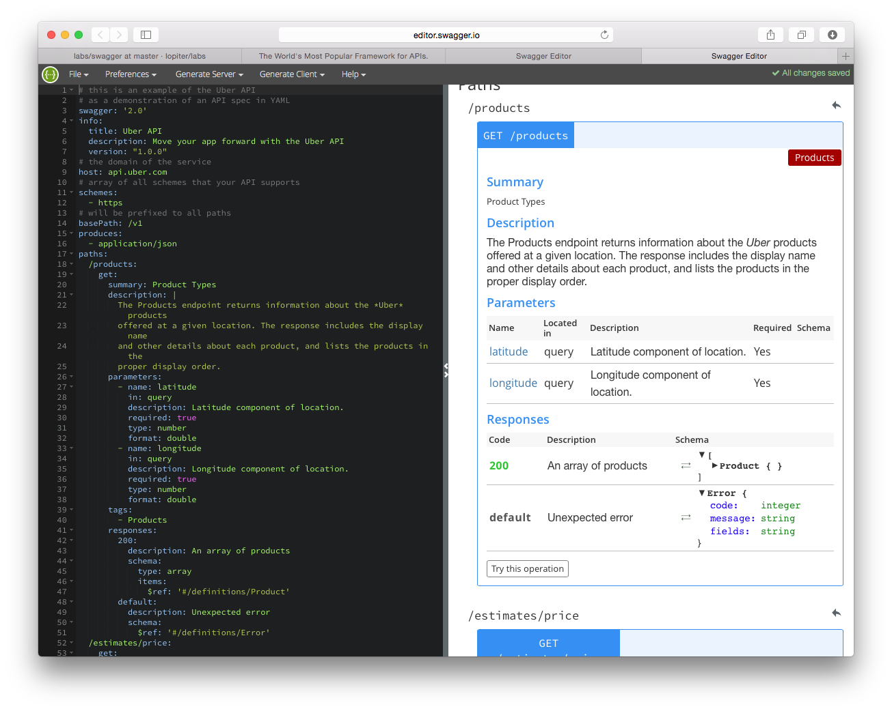

#Swagger
- Restful API 문서화를 위한 도구
- site : http://swagger.io

##Swagger UI

##Swagger Editor
- YAML로 작성된 문서를 활용하여 Restful 문서를 시작화하여 보여줌


- 설치방법
1. nodejs 설치
2. git clone
```
git clone https://github.com/swagger-api/swagger-editor.git
```
3. 복제된 디렉토리로 이동(cd swagger-editor)
4. npm start 명령어 실행
5. 이후에는 grunt server 명령어를 실행
6. http://localhost:9000로 접속하여 확인
