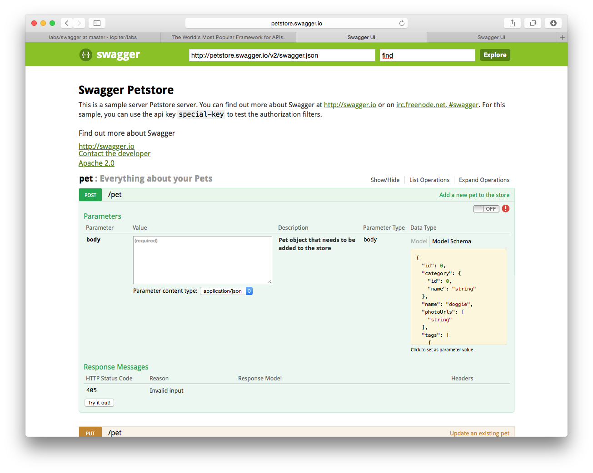

#Swagger
- Restful API 문서화를 위한 도구
- site : http://swagger.io

##Swagger UI
swagger 스펙에 맞게 작성된 json 파일을 문서화 하여 보여준다.

1. git clone : https://github.com/swagger-api/swagger-ui.git
2. dist 디렉토리에 index.html을 브라우저로 열어보면 api 문서를 확인 할 수 있음.
3. Swagger 스펙(https://github.com/swagger-api/swagger-spec) 에 맞추어 json 파일을 작성후 index.html 파일을 수정하여 작성한 json 파일이 로드 될 수 있도록 한다.

##Swagger Editor
YAML로 작성된 문서를 활용하여 Restful 문서를 시작화하여 보여줌

- 설치방법

1. nodejs 설치
2. git clone : https://github.com/swagger-api/swagger-editor.git
3. 복제된 디렉토리로 이동(cd swagger-editor)
4. npm start 명령어 실행
5. 이후에는 grunt server 명령어를 실행
6. http://localhost:9000로 접속하여 확인
